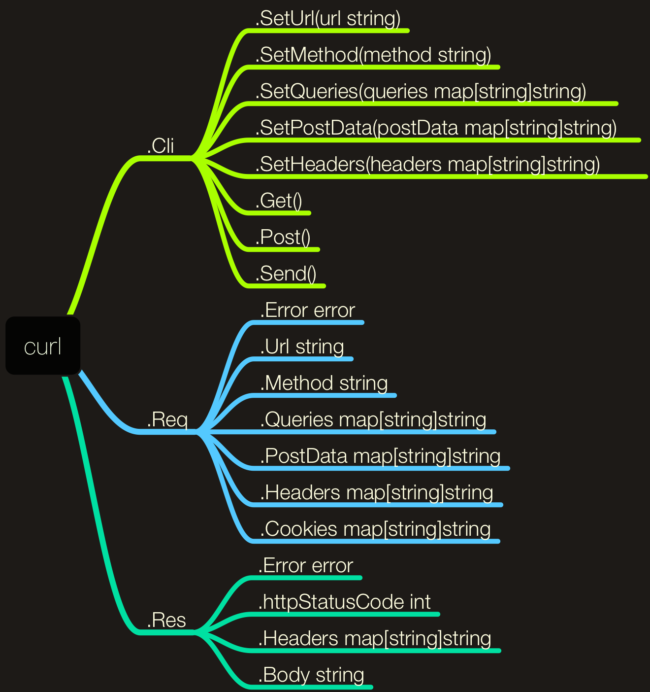

# golang版本的curl请求库


## 安装

```
go get github.com/mikemintang/go-curl
```
  
## 使用

```
package main

import (
    "fmt"
    "github.com/mikemintang/go-curl"
)

func main() {

    url := "http://php.dev/api.php"

    headers := map[string]string{
        "User-Agent":    "Sublime",
        "Authorization": "Bearer access_token",
        "Content-Type":  "application/json",
    }

    cookies := map[string]string{
        "userId":    "12",
        "loginTime": "15045682199",
    }

    queries := map[string]string{
        "page": "2",
        "act":  "update",
    }

    postData := map[string]interface{}{
        "name":      "mike",
        "age":       24,
        "interests": []string{"basketball", "reading", "coding"},
        "isAdmin":   true,
    }

    // 链式操作
    req := curl.NewRequest()
    resp, err := req.
        SetUrl(url).
        SetHeaders(headers).
        SetCookies(cookies).
        SetQueries(queries).
        SetPostData(postData).
        Post()

    if err != nil {
        fmt.Println(err)
    } else {
        if resp.IsOk() {
            fmt.Println(resp.Body)
        } else {
            fmt.Println(resp.Raw)
        }
    }

}

```


## 接收请求的api.php
```
<?php  

//echo json_encode($_GET);                      // 获取url地址中的查询参数
//echo json_encode(getallheaders());            // 获取请求头
//echo json_encode($_COOKIE);                   // 获取cookies
echo file_get_contents("php://input");          // 获取post提交的数据

function getallheaders() { 
    $headers = []; 
    foreach ($_SERVER as $name => $value) { 
       if (substr($name, 0, 5) == 'HTTP_') { 
           $headers[str_replace(' ', '-', ucwords(strtolower(str_replace('_', ' ', substr($name, 5)))))] = $value; 
       } 
    } 
    return $headers; 
} 
```

## 可导出的成员变量和方法


## TodoList

- [x] 以链式操作的方式发起请求
- [ ] 以函数回调的方式发起请求
- [ ] 以类Jquery Ajax的方式发起请求
- [x] 发起GET/POST请求
- [ ] 发起PUT/PATCH/DELETE/OPTIONS操作
- [x] 以application/x-www-form-urlencoded形式提交post数据
- [x] 以application/json形式提交post数据
- [ ] 以multipart/form-data形式提交post数据
- [ ] proxy代理设置
